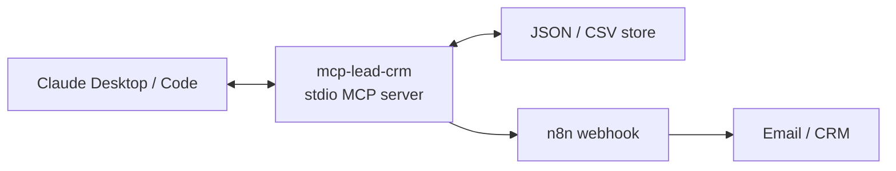

# mcp-lead-crm

[](https://github.com/svtxvt/mcp-lead-crm/actions/workflows/ci.yml)

A local, open-source MCP server that lets Claude manage a small-business lead pipeline and trigger n8n workflows.
The dry-run demo runs without accounts, API keys, or hosted infrastructure. Runtime dependencies require no native addons; development tooling includes platform-specific binaries.



## 30-second demo


The clip is an edited, abbreviated illustration, not a verbatim execution trace ([MP4 version](docs/demo.mp4)). It omits required arguments such as `qualify_lead.reason`; the [reproduction script](docs/demo-script.md) supplies them. The n8n step is a dry run: no webhook or email is sent.

## Install in 30 seconds

Requires Node.js 20.19 or newer (CI covers 20.19 and 22.x).

```bash
git clone https://github.com/svtxvt/mcp-lead-crm.git
cd mcp-lead-crm
npm i
npm run build
npm run seed
```

Claude Desktop (`claude_desktop_config.json`):

```json
{
  "mcpServers": {
    "lead-crm": {
      "command": "node",
      "args": ["/absolute/path/to/mcp-lead-crm/dist/index.js"],
      "env": {
        "LEAD_CRM_DB": "/absolute/path/to/mcp-lead-crm/data/crm.json"
      }
    }
  }
}
```

Claude Code:

```bash
claude mcp add lead-crm -e LEAD_CRM_DB=/absolute/path/to/mcp-lead-crm/data/crm.json -- node /absolute/path/to/mcp-lead-crm/dist/index.js
```

Run directly with `node dist/index.js`, or develop with `npx tsx src/index.ts`.

- `LEAD_CRM_DB`: JSON database path; defaults to `./data/crm.json`.
- `N8N_WEBHOOK_URL`: optional HTTP(S) webhook URL without embedded credentials. If omitted, `trigger_n8n` returns a dry run and records it only when `lead_id` is given.

CSV imports require this 11-column export header:

```csv
id,name,email,phone,company,source,stage,score,created_at,updated_at,notes
```

Import is a full-row upsert by `id`: blank cells clear optional fields. The store validates the canonical parent directory and filesystem identity for CSV paths. Paths must remain within the database directory; database aliases (including case aliases on case-insensitive filesystems, symlinks, and hardlinks) are rejected. Exports reject symlink destinations and publish a temporary file with an atomic rename after validation.

Multiple server processes may share the same canonical database path on a local filesystem. Each mutation takes an exclusive adjacent `.lock` file, re-reads the JSON while holding it, and atomically publishes the update before acknowledging success. Lock acquisition retries with jitter for up to five seconds, then fails without changing the database. A dead PID's lock is reclaimed under an exclusive `.lock.reap` guard; a live PID's lock is never stolen. Malformed/empty lock files or an abandoned reclamation guard fail closed: stop all servers using the database before inspecting and removing those files. CSV operations cannot use database lock paths or their aliases. Do not configure separate hardlink names for the database, use network filesystems, or edit the JSON concurrently outside this locking contract.

Webhook requests refuse redirects and combine a ten-second timeout, including response-body consumption, with MCP request cancellation. Successful calls return the HTTP status, without echoing the receiver's response body. Store and webhook failures return generic client errors; diagnostic detail goes to stderr.

On SIGINT/SIGTERM the server stops accepting work and allows started store writes and webhook calls up to five seconds to finish before closing and exiting. Cancellation, a timeout, forced termination, or failure to save the activity can still leave a remotely accepted webhook without a local record. Reconcile with n8n before retrying; delivery is not exactly-once.

Re-seeding a non-empty CRM is refused; use `LEAD_CRM_SEED_FORCE=1 npm run seed` only to intentionally reset demo data.

## What Claude can do

The server exposes tools to add, qualify, move, search, import, and export leads; log activities; list the pipeline and due follow-ups; and trigger n8n. It also serves `crm://pipeline/summary` and `crm://lead/{id}`, plus the `daily_followup_briefing` prompt.

For a one-minute walkthrough with the required qualification reason, use [docs/demo-script.md](docs/demo-script.md).

## Protocol support

Built on the MCP TypeScript SDK v2 (`@modelcontextprotocol/server` 2.x). The stdio entry point uses `serveStdio`, so one process serves both protocol eras: the **2026-07-28** revision (stateless, `server/discover`, no `initialize` handshake) and **2025-era clients** that still open with the `initialize` handshake. A v2 client opts into the newer revision with `versionNegotiation: { mode: "auto" }` or pins it with `{ mode: { pin: "2026-07-28" } }`; both paths are covered by `tests/protocol.test.ts`. Legacy tests use the v2 client in legacy handshake mode; this suite does not establish interoperability with an actual v1 client package.

## Tests

`npm test` builds the server. The final local run passed 58 tests in 7 files with no skips: store path/alias protection, atomic publish failures, CSV rollback and multi-process writes; the seed script; structural n8n workflow checks; stdio tools/resources/prompts; webhook validation, redirects, sanitization and cancellation; both protocol eras; and SIGINT/SIGTERM draining and the five-second shutdown deadline. Filesystem alias tests detect the relevant filesystem behavior at runtime and skip when unsupported. GitHub Actions is configured to run the same suite on Node.js 20.19 and 22.x.

## n8n example

[examples/n8n-followup-email.json](examples/n8n-followup-email.json) targets n8n 2.37.7: Webhook → IF → Set → disabled email placeholder. It has been structurally validated only (node types, connections, and absence of credentials); import and execution in n8n have not been verified. Before using it, import and test it in your n8n instance, replace the placeholder with an action you control, activate it, then copy its production webhook URL into `N8N_WEBHOOK_URL`.

## Extend it

`JsonStore` implements the exported `Store` interface. A HubSpot or Google Sheets adapter starts as this stub; implement the same contract and pass it to `createServer`.

```ts
import type { Store } from "./src/store.js";

class HubSpotStore implements Store {
  // Implement Store with credentials supplied by the person running the server.
}
```

Built by Sergey Yashchuk, senior full-stack engineer. Available for part-time contract work on MCP integrations and product engineering around AI systems: sergey.yashchuk1@gmail.com.

Demo data is fictional. MIT licensed and provided without warranty.
