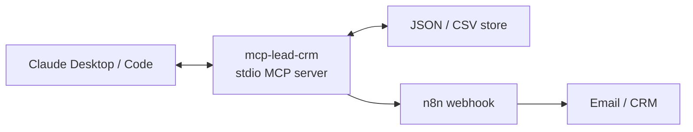
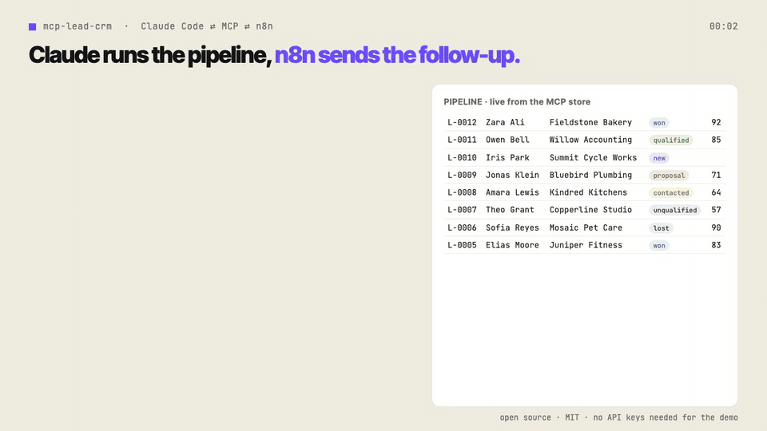

# mcp-lead-crm

[](https://github.com/svtxvt/mcp-lead-crm/actions/workflows/ci.yml)

A local, open-source MCP server that lets Claude manage a small-business lead pipeline and trigger n8n workflows.
The demo runs without accounts, API keys, native modules, or hosted infrastructure.



## 30-second demo



Every tool call in the clip is real output from this server on the seeded demo data ([MP4 version](docs/demo.mp4), [script](docs/demo-script.md)).

## Install in 30 seconds

Requires Node.js 20 or newer.

```bash
git clone https://github.com/svtxvt/mcp-lead-crm.git
cd mcp-lead-crm
npm i
npm run build
npm run seed
```

Claude Desktop (`claude_desktop_config.json`):

```json
{
  "mcpServers": {
    "lead-crm": {
      "command": "node",
      "args": ["/absolute/path/to/mcp-lead-crm/dist/index.js"],
      "env": {
        "LEAD_CRM_DB": "/absolute/path/to/mcp-lead-crm/data/crm.json"
      }
    }
  }
}
```

Claude Code:

```bash
claude mcp add lead-crm -e LEAD_CRM_DB=/absolute/path/to/mcp-lead-crm/data/crm.json -- node /absolute/path/to/mcp-lead-crm/dist/index.js
```

Run directly with `node dist/index.js`, or develop with `npx tsx src/index.ts`.

- `LEAD_CRM_DB`: JSON database path; defaults to `./data/crm.json`.
- `N8N_WEBHOOK_URL`: optional webhook URL. If omitted, `trigger_n8n` returns and records a dry run.

CSV imports require the documented 11-column export header. Import is a full-row upsert by `id`: blank cells clear optional fields. Import/export paths are resolved inside the directory containing `LEAD_CRM_DB`; paths outside it and the database file itself are rejected. Re-seeding a non-empty CRM is refused; use `LEAD_CRM_SEED_FORCE=1 npm run seed` only to intentionally reset demo data.

## What Claude can do

The server exposes tools to add, qualify, move, search, import, and export leads; log activities; list the pipeline and due follow-ups; and trigger n8n. It also serves `crm://pipeline/summary` and `crm://lead/{id}`, plus the `daily_followup_briefing` prompt.

For a one-minute walkthrough, use [docs/demo-script.md](docs/demo-script.md); the GIF above follows the same steps.

## Protocol support

Built on the MCP TypeScript SDK v2 (`@modelcontextprotocol/server` 2.x). The stdio entry point uses `serveStdio`, so one process serves both protocol eras: the **2026-07-28** revision (stateless, `server/discover`, no `initialize` handshake) and **2025-era clients** that still open with the `initialize` handshake. A v2 client opts into the newer revision with `versionNegotiation: { mode: "auto" }` or pins it with `{ mode: { pin: "2026-07-28" } }`; both paths are covered by `tests/protocol.test.ts`.

## Tests

`npm test` builds the server and runs 24 tests in 6 files: the store (concurrent writes, CSV round trips, rejected out-of-directory paths), the seed script, the shipped n8n workflow, the full tool/resource/prompt surface over a real stdio connection, the live webhook branch against a local HTTP receiver, and protocol-era negotiation. The same suite runs in GitHub Actions on Node.js 20 and 22.

## n8n example

[examples/n8n-followup-email.json](examples/n8n-followup-email.json) is a credential-free n8n 2.37.7 workflow: Webhook → IF → Set → disabled email placeholder. Import it into n8n, replace the placeholder with an action you control, activate it, then copy its production webhook URL into `N8N_WEBHOOK_URL`.

## Extend it

`JsonStore` implements the exported `Store` interface. A HubSpot or Google Sheets adapter starts as this stub; implement the same contract and pass it to `createServer`.

```ts
import type { Store } from "./src/store.js";

class HubSpotStore implements Store {
  // Implement Store with credentials supplied by the person running the server.
}
```

Built by Sergey Yashchuk (senior engineer). I build custom MCP servers, n8n automations and AI agents for small businesses — [Fiverr](https://www.fiverr.com/sergeyyaschook). If you reach out, mention **mcp-lead-crm** so I know where you found it.

Demo data is fictional. MIT licensed and provided without warranty.
